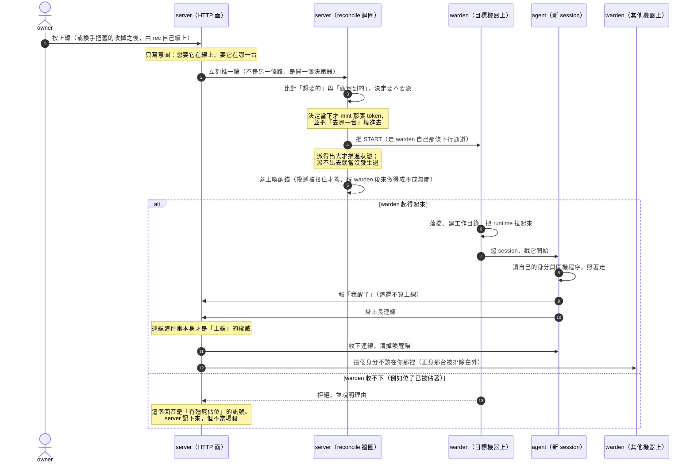

# 一個 agent 是怎麼被起起來的（上線流程）

## 這份文件是什麼

**它是導覽，不是規格。** 它回答的問題是：「上線」這件事由哪些塊組成、每一塊負責什麼、塊與塊之間靠什麼銜接、哪一步不可逆、出錯時往哪個方向倒。

它是 [`offboard-flow.md`](offboard-flow.md)（下線那條）的對稱面。兩份重疊的地方（命令怎麼推、回執是什麼、殭屍、fail-closed、重啟後的第一輪）**互相指路，不各寫一份會漂的敘述**。

存在的理由：`spec/lifecycle.md` §4 規範了決策規則、`docs/design/state-model.md` 定了狀態語意、`docs/guide/architecture.md` 給了使用者視角——但**沒有一處把這條鏈串起來**。每個想知道「我按下上線之後會發生什麼」「為什麼它卡在喚醒中」的人，都得自己追五六個檔案。這份文件就是那趟追蹤的成果。

**零複製規則**：本文**不定義任何規範性數字**。死線、退避、窗口一律**引用名字**，數值去 `spec/lifecycle.md` 查。（這條規則的代價經驗寫在 `offboard-flow.md` 第一節，那份文件自己就是那個代價。）

### 誰是哪件事的權威

| 你想知道 | 去讀 |
|---|---|
| 這條流程怎麼串起來、哪裡會斷 | 本文 |
| 下線／被收掉那條怎麼串 | `offboard-flow.md` |
| 決策規則的規範性內容與所有數值 | `spec/lifecycle.md` |
| 狀態語意（intent vs observed、online 憑什麼） | `docs/design/state-model.md` |
| 使用者視角的「它在幹嘛」 | `docs/guide/architecture.md` |
| agent 開機到底照什麼做 | **設定 › 角色誌 › 啟動程序**（owner 可編輯的權威版，出廠版在 `seeds/`） |

---

## 全景：一次上線的訊息往來

圖只畫**最不會變的那一層**：角色、訊息方向、關鍵扳機。**秒數、條件分支與例外刻意不進圖**——它們會變，而圖一旦畫上就沒人回來改。那些留在下面的文字裡。

⚠️ **圖上刻意沒有的東西**：所有時間、兩種 runtime 的差異、退避與重試、以及每個失敗分支的細節。**它們不是被省略，是被放到文字裡**——因為它們正是會變的那一層。

圖上**只留了一條分支**，而且它在這裡不是「失敗處理」：warden 說「位子已經被佔著」時，那句話**改變了 server 的結論**（它據此判定有殭屍），所以它是這條流程的組成部分，不是一個錯誤路徑。**其他所有出錯的形狀都不在圖上。**

---

## 一、有哪些塊，各自負責什麼

| | 負責 | **不**負責 |
|---|---|---|
| **owner** | 表達意圖（要它在線上、要它在哪一台） | 決定什麼時候真的派命令。他按的是意圖，不是動作 |
| **server（HTTP 面）** | 受理意圖、寫 durable 狀態、廣播 delta，然後**踢一輪決策** | 自己決定要不要起。它不做決策，只是把決策提早觸發 |
| **server（reconcile 迴圈）** | **唯一的決策者**：比對想要的與觀察到的，決定要送什麼命令；**並在決定的那一刻 mint token** | 執行。它一行行程都沒起過 |
| **warden** | **執行**：落檔、建目錄、把 runtime 拉起來、回報結果 | **決定要起誰**。也不重試——重試是 server 的事 |
| **agent** | 讀自己的身分、照開機程序走、自報狀態、掛上連線 | 決定自己何時被起。它連自己有沒有被派過都不知道 |

**這個切法跟下線那條是同一套**（決策集中在一處、執行在另一處），差別在**上線這條沒有繞道**：下線有「強制下線」那種繞過決策器的直接投遞，**上線沒有等價的東西**。要起一個 agent，只有走決策器這一條路。

---

## 二、塊與塊之間靠什麼銜接

### 命令是推的，不是拉的

START 走 **warden 自己那條對外長連線的下行方向**——因為 server 打不進 NAT 後面的 Mac。有資格接收的判準是**連線者 token 解出來的身分是不是一台 warden**，而收件位址是**那台 warden 的身分**，不是連線端自報的主機名。

**沒有 correlation id**，回音是**回執**——這一段的語意與下線那條完全相同，寫在 `offboard-flow.md`「但『沒有 id』不等於『沒有回音』」一節，不在這裡重寫。

### 派不出去，就當沒發生

投遞是一道 **fail-closed 閘**：目標解不出來、或那台 warden 不在線，就**不投遞、狀態也不推進**。原則是「**決策器絕不記錄它沒送出去的命令**」。

⇒ 所以「決定要派」本身**不是**不可逆的點；不可逆從**投遞被接受**那一刻開始（見第七節）。

---

## 三、上線的觸發來源

四種，而**其中一種最容易被寫錯**：

1. **owner 按上線**（或 admin agent 用同一條介面）。
2. **首次開機的 onboarding**。
3. **殭屍被收掉之後的下一輪**。
4. 🔴 **換手重生**——**它不派任何「重啟」命令**。

### 🔴 換手重生不是一道 restart

決策器認得的命令只有幾個，而**裡面沒有 restart**。換手的實際形狀是：

> 蓋上換手記號 → 舊 session 被停掉 →「想要它在線上」這個意圖**全程沒有變過** → **下一輪的普通 START 就是重生**。

⇒ **「server 送了一道 restart 給它」是憑空的**。會這樣寫的人，是把使用者看到的行為（它換了一手）當成了介面上的一道命令。

這也解釋了為什麼**換手期間 desired_state 一直是 online**：如果它變成 offline，就沒有東西會把下一代起回來了。

---

## 四、機器與 runtime 是兩道閘，而且沒有自動放置

### 🔴 沒有選機器，就一台都不會挑

**server 不會替你挑一台**。沒指定機器、或指定的那台不能用時，受理由逐字是「**沒有自動放置**」「**不替代任何機器**」——外包那邊曾經有一條「fall back 到別台」的臂，在 **owner 2026-07-25 的裁定下已經刪光**。

⚠️ 這一格是**空白造成的誤解來源**：owner 把一台機器關掉、發現人起不來，而畫面上只寫「機器不可用」——他很容易以為系統會自己找別台。**不會。** 要換台就得明說。

（新僱的成員預設會 pin 到 server 那台 ⇒ 「沒機器」不是預設狀態，是 pin 被清掉才會落到。）

### runtime 可用性是第二道閘，而且**兩種 runtime 不對稱**

- 沒有回報能力清單的**舊 warden**，一律當作 claude 可用（為了滾動升級相容）。
- **claude 一律視為可用**。
- **只有 codex 真的檢查裝了沒、登入了沒。**

⇒ 「系統會檢查 runtime 有沒有登入」這句話**只對 codex 成立**。

---

## 五、warden 端做了什麼，以及它的拒絕是什麼訊號

收到 START 之後，warden 依序做：認得這道命令嗎 → 三個必要欄位齊嗎 → runtime 這一關過嗎 → **確認位子沒被佔** → 建工作目錄 → **清掉回收區（每次都做，而且做了回不來）** → 寫下身分與設定檔（含那張 token，權限收緊） → 放好 CLI → 起 session。

**它一次都不重試。** 重試是 server 的事，這是刻意的：兩邊都重試會變成同一個動作被做兩次而沒人知道總共幾次。

### 🔴 「位子已經被佔著」是這條鏈上最重要的回音

warden 的拒絕理由是一個**閉集合**，其中「**session 已經存在**」被 server 端特別認得：它代表「**有一個還活著、但已經聽不到 presence 的殭屍佔著位子**」。

**但 server 不當場殺它。** 它要等一個連續離線的二次確認窗，窗內只要那條連線回來就取消——**事故背景是：曾經有一道 STOP 撞上一個正在重連的 session。**

另外：warden **只在真的探到 session 存在時才拒絕**；**探測本身壞掉不會擋**——這個方向是刻意的（寧可多起一次，不要因為探測故障就永遠起不來）。

---

## 六、🔴 最後一哩不在任何程式的控制流裡

這是整條鏈最反直覺、也最該讓人知道的一件事。

**agent 掛上那條長連線這一步，不是任何程式碼呼叫的**。warden 把 session 起起來、戳它一句「開始。」，接下來**是 LLM 讀了自己的開機程序、照著第三步自己去掛的**。

⇒ **誰改壞了那份開機程序的第三步，整個機隊都會在死線之後變成「叫不醒」——而每一層的 log 都會說自己成功了。** server 說我派出去了、warden 說我起起來了、runtime 說 session 在跑，沒有任何一層在說謊，**只是沒有人在檢查那件真正該發生的事有沒有發生**。

### ⚠️ 而兩種 runtime 在這一點上**剛好相反**

- **claude**：開機程序明寫「**自己去掛上連線**」。
- **codex**：開機程序明寫「**不要自己掛**」——它是被 sidecar 以無終端機的方式起起來的，**連線由 sidecar 持有**，掛好之後才會再叫它一次。

⇒ **一句話蓋不住兩種 runtime。** 任何寫成「agent 開機後會掛上 SSE」的敘述，對其中一種是錯的。

（agent 拿到的第一段提示**不是**開機程序本身，只是一張**指路條**：你的身分與程序都在某個檔案裡，去讀它、照著走。真正的程序是 server 折給它的那份，而**啟動程序那一塊放在最後**——因為越後面的內容越權威。）

---

## 七、「喚醒中」跟「線上」分別憑什麼

**線上的權威只有一個：那條長連線活著。** 不是 DB 上的欄位、不是命令的回傳值、也不是回執——**回執可能說它死了，而那個行程還活著在回話**。

**「喚醒中」是衍生態**，三個條件缺一不可：有 durable 的意圖 + 有一個時間錨 + **沒有連線**。它不會被「翻成」線上，**是被線上蓋掉**。

### 🔴 那個時間錨現在有兩個 writer，而第一個是 server

以前只有 agent 自己報「我醒了」會蓋它 ⇒ **只有成功開機的 agent 蓋得到，於是「開機失敗的」和「從來沒人叫過的」長得一模一樣。**

現在 **START 一投遞出去，server 就先蓋上**。

⚠️ **這裡有兩件很容易被混成一件的事，而它們發生在不同時刻**：
- **「投遞被接住」**——目標那台 warden 解得出來、而且在線上，於是那道命令排進了它的佇列。**這是同步的、server 端就知道結果的**，而蓋錨的判準正是這一個（派不出去的那次**不蓋**，有測試釘住）。
- **「warden 做得成」**——它後來真的把 session 起起來了，還是回一個拒絕（例如位子被佔著）。**這是稍後才知道的另一件事**，跟蓋不蓋錨無關。

差別很實際：

- 照舊敘述：一個從沒起來的 agent 顯示成「離線」。
- 照現行碼：它會「喚醒中」一段時間，然後**帶著一個逾時受理由落回離線**——**而後者才是 owner 在座艙真的看到的**。

清掉這個錨的有兩個時機：**連線第一次接上**，以及**等太久放棄時**（讓它讀回離線，而不是永遠掛在喚醒中）。

### 連線接上的那一刻，server 還做了幾件事

依序是：先過「這個 session 是不是已經被切斷了」那道閘（**在收下連線之前**）→ 收下（同一身分的舊連線會被接管）→ 清喚醒錨、還原這一代的開機錨（**durable 有值就還原，絕不重蓋成現在**）→ 記下它實際落在哪一台 → **對所有其他機器廣播「這個身分不該在你那裡」**（它正身所在的那台被結構性排除在外）。

⚠️ **外包 worker 的喚醒錨是記憶體的**（沒有 durable 欄位）⇒ **server 一重啟，正在開機的 worker 會直接被讀成離線。**

---

## 八、失敗、退避與兩條長得一樣的死線

### 兩條死線，語意不同，抄成一條就會錯

- **「派了但沒連上來」**——判準是 **presence**。
- **「派了但沒有回音」**——判準是**回執有沒有到**。

兩條的長度目前相同，**但來源不同**（一個是心跳的倍數，一個是從 warden 的工作預算推導的）⇒ **它們不是同一個常數，未來也沒有理由一起變。**

### 退避有，斷路器沒有

起不來會**上退避**（等久一點再試），但**不會**觸發斷路器：斷路器的參數在碼上存在，**卻沒有任何產線路徑會啟用它**。

⇒ 🔴 **「起不來幾次就會斷路」是把規格當現況。**（本文不寫次數與秒數，見零複製規則。）

**warden 端零重試**，前面說過。**外包被擋下之後會原地站著不動**——因為沒有自動改派，碼裡甚至有一段註解專門更正舊說法的「會輪到別台」。

---

## 九、不可逆的點

**決策本身不是不可逆的**（派不出去就不推進狀態）。**不可逆從投遞被接受那一刻開始**，之後陸續發生：

- 清掉前一代的 session 錨
- 蓋上喚醒錨，並**刪掉上一次投遞失敗的證據**
- 寫進那條下行通道（**這個方向沒有 ack**）
- warden 清掉回收區
- 覆寫身分與 token 檔
- （claude）改寫信任檔——**這一步失敗會中止整個 spawn**
- session 真的起來
- 對其他機器廣播身分掃蕩
- 殭屍接管的那道 STOP 落地

### 🔴 三層都可能斷，而受理由會互相污染

投遞成功只代表**排進了一個佇列**；取出是**破壞性的**，取出後寫失敗的那一份**誰手上都沒有**，而 **START 是直接丟掉不重排的**（它帶著一張當下的 token，留著也沒用）。「寫進了通道」**不是 ack**。

碼裡的註解自己承認：這幾條臂在同一輪裡又逾時又重派時，**受理由會互相蓋掉**（重派會刪掉上一次失敗的證據）。

⇒ **不要宣稱畫面上那個受理由一定準確。** 它是最後一次寫入的那一個，不是完整的歷史。

---

## 十、出錯時往哪一邊倒

整體是 **fail-closed**（不確定就不動），但有兩個不對稱值得單獨記：

1. **決策迴圈可以整個被關掉**（shadow 部署用）。關掉之後：意圖寫得進去、presence 照跑、SSE 照送——**只是沒有人起、也沒有人收**。看到一個「狀態都對但什麼都不動」的機隊，先問這個開關。
2. 🔴 **重啟後的第一輪，不等於穩定狀態的一輪。** 決策器的記憶是可丟的，一丟**退避就歸零** ⇒ 一個反覆起不來的成員會拿到**全新的重試預算**。**那是更積極，不是更安全。**（同一個形狀在下線那條也有，`offboard-flow.md` 記過。）而殭屍二次確認窗重開則是**安全方向**——同一次重啟，兩個相反的倒向。

---

## 十一、這份文件什麼時候會過期

改到下面這幾塊的人，就是該回來更新它的人：

- 決策器認得的命令集合（尤其是**如果有人真的加了一道 restart**）
- 機器選擇與 runtime 可用性那兩道閘
- warden 的拒絕理由集合
- **開機程序那份 seed 的第三步**（兩種 runtime 各一份）
- 喚醒錨的 writer 與清除時機

如果你發現本文某句話跟碼對不上，**碼是對的**，請直接修這份文件；如果對不上的是 `spec/lifecycle.md` 或 `docs/design/state-model.md`，先確認是文件落後還是碼跑偏了，**不要自己選邊**。

---

## 附：這份文件刻意沒有回答的問題

盤點時有四格我**沒有查到足以下判斷的程度**。它們留在這裡當缺口，**不是被遺漏，是被標記**——因為把「不知道」寫成一句順的話，比空著更難發現：

1. **座艙前端怎麼呈現「喚醒中」與那些受理由**——沒讀前端，不知道。
2. **兩種受理由共用同一個欄位時，實際的覆寫順序**——只知道會互相污染（第九節），**沒有讀完整的覆寫順序**。
3. **warden 傳給子行程的環境變數，到底是白名單還是黑名單**——碼上讀起來是黑名單加保留字首，而 `server/CLAUDE.md` 寫的是白名單。**兩邊原文都在，方向相反，我不選邊**：可能是在講另一個接縫，也可能是其中一份過期，**目前沒有足以判死的證據**。
4. **斷路器是不是真的完全沒有產線呼叫者**——讀到註解、也 grep 過，**但沒有跑覆蓋率驗證**。第八節那句「沒有任何產線路徑會啟用它」的把握度僅止於此。

### 🔴 已知落後、已另案回報的（本文照碼寫）

- `spec/lifecycle.md` 有三處落後於碼（決策迴圈的關閉開關、機器 fallback、命令佇列的重啟語意）。**已回報 owner，等他裁定要不要動凍結契約**，本文不自行抹平。
- `docs/design/state-model.md` 下游有一節與它自己的 §3 矛盾（換機器是不是手動）。**另開票處理。**
- `docs/guide/architecture.md` 說「成員一起手會先報一次喚醒中」——現在 **server 才是第一個 writer**（第七節）；另有一句「warden 不巡檢成員死活」在**起**這條路上不成立（它會探 session 與登入狀態）。
